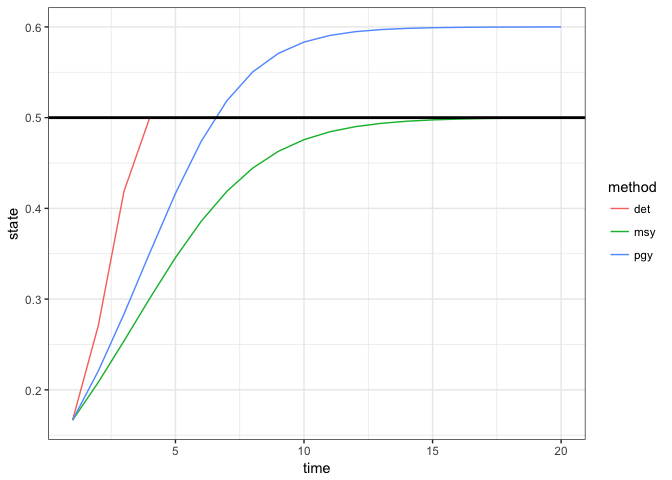
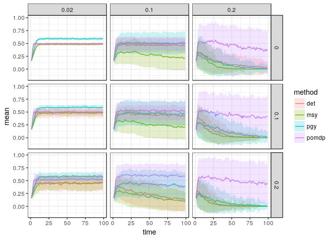

POMDP comparisons across sigma\_m, sigma\_g
================
Carl Boettiger
2017-10-01

``` r
# devtools::install_github("boettiger-lab/sarsop")  ## install package first if necessary.
library(sarsop)       # the main POMDP package
library(tidyverse)    # for munging and plotting
library(parallel)
```

Basic deterministic model
-------------------------

``` r
r <- 0.75
K <- 1

## Classic Graham-Schaefer. Note that recruitment occurs *before* harvest
f <- function(x, h){ 
    x + x * r * (1 - x / K) - pmin(x,h)
}
```

Utility (reward) function:

``` r
reward_fn <- function(x,h) pmin(x,h)
discount <- 1
```

Calculating MSY
---------------

This uses a generic optimization routine to find the stock size at which the maximum growth rate is achieved.

``` r
## A generic routine to find stock size (x) which maximizes 
## growth rate (f(x,0) - x, where x_t+1 = f(x_t))
S_star <- optimize(function(x) -f(x,0) + x / discount, 
                   c(0, 2*K))$minimum
```

``` r
B_MSY <- S_star
MSY <- f(B_MSY,0) - B_MSY 
F_MSY <- MSY / B_MSY  

F_PGY = 0.8 * F_MSY
```

### Optional checks:

``` r
## Make sure these match the known analytic solutions for Graham-Schaefer model:
testthat::expect_equal(B_MSY, K / 2)
testthat::expect_equal(MSY, r * K / 4)
testthat::expect_equal(F_MSY, r / 2)
```

As a basic reference point, simulate these three policies in a purely deterministic world. Unlike later simulations, here we consider all states an actions exactly (that is, within floating point precision). Later, states and actions are limited to a discrete set, so solutions can depend on resolution and extent of that discretization.

We first define functions that correspond to each policy:

``` r
msy_policy <- function(x) F_MSY * x
pgy_policy <- function(x) F_PGY * x

escapement_policy <- function(x){  ## ASSUMES harvest takes place *after* recruitment
  if(f(x,0) > B_MSY)
    f(x,0) - B_MSY
  else
    0
}
```

``` r
# inits
x0 <- K/6
Tmax = 20

# a simulation function
det_sim <- function(policy, f, x0, Tmax){
    action <- state <- obs <- as.numeric(rep(NA,Tmax))
    state[1] <- x0
    for(t in 1:(Tmax-1)){
      action[t] <- policy(state[t])
      obs[t] <- state[t] - action[t]  # if we observe after harvest but before recruitment
      state[t+1] <- f(state[t], action[t]) 
    }
    data.frame(time = 1:Tmax, state, action, obs)
  }

# simulate each policy, returning all results in a single unified data frame 
sims <- 
  list(msy = msy_policy, 
       det = escapement_policy, 
       pgy = pgy_policy) %>% 
  map_df(det_sim, 
         f, x0, Tmax, 
         .id = "method") 
```

``` r
# plot simulation results 
sims %>%
  ggplot(aes(time, state, col=method)) + 
  geom_line() + 
  geom_hline(aes(yintercept=B_MSY), lwd=1) 
```



------------------------------------------------------------------------

Introduce a discrete grid
-------------------------

We compute the above policies on this grid for later comparison.

``` r
states <- seq(0,2, length=100)
actions <- states

## Harvest after recruitment
det_policy <- sapply(states, function(x) pmax(f(x,0) - S_star,0))
det_action <- sapply(det_policy, function(x) which.min(abs(actions - x)))
msy_action <- sapply(states, function(x) which.min(abs(actions - x * F_MSY)))
pgy_action <- sapply(states, function(x) which.min(abs(actions - x * F_PGY)))
```

POMDP Model
===========

We compute POMDP matrices for a range of `sigma_g` and `sigma_m` values:

``` r
observations <- states # same discretization, for convenience


meta <- expand.grid(sigma_g = c(0.02, 0.1, 0.2), 
                    sigma_m = c(0, 0.1, 0.2),
                    stringsAsFactors = FALSE)

models <- 
  parallel::mclapply(1:dim(meta)[1], 
           function(i){
  fisheries_matrices(
  states = states,
  actions = actions,
  observed_states = observations,
  reward_fn = reward_fn,
  f = f,
  sigma_g = meta[i,"sigma_g"][[1]],
  sigma_m = meta[i,"sigma_m"][[1]],
  noise = "normal")
})
```

Simulating the static policies under uncertainty
------------------------------------------------

``` r
# inits
x0 <- which.min(abs(states - K/6))
Tmax <- 100
reps <- 100
options(mc.cores = parallel::detectCores())

static_sims <-
  map_dfr(models, 
          function(m){
            do_policy_sim <- function(policy){
              sim <- sim_pomdp(m$transition, m$observation, m$reward, discount, 
                               x0 = x0, Tmax = Tmax, policy = policy, reps = reps)
              sim$df %>% 
                mutate(state = states[state], action = actions[action])
            }
            
            list(msy = msy_action, 
                 det = det_action, 
                 pgy = pgy_action) %>% 
              map_df(do_policy_sim, .id = "method")
          },
          .id = "scenario") 
```

``` r
# add parameter metadata to the output data.frame to track which simulation had which parameters
meta_simple <-  
  meta %>% 
  select(sigma_m, sigma_g) %>%
  mutate(scenario  = as.character(1:dim(meta)[1]))
static_sims <- right_join(meta_simple, static_sims)
```

``` r
# plot
static_sims %>%
  select(time, state, rep, method, sigma_m, sigma_g) %>%
  group_by(time, method, sigma_m, sigma_g) %>%
  summarise(mean = mean(state), sd = sd(state)) %>%
  ggplot(aes(time, mean, col=method, fill=method)) + 
  geom_line() + 
  geom_ribbon(aes(ymax = mean + sd, ymin = mean-sd), col = NA, alpha = 0.2) +
  facet_grid(sigma_m ~ sigma_g)
```


