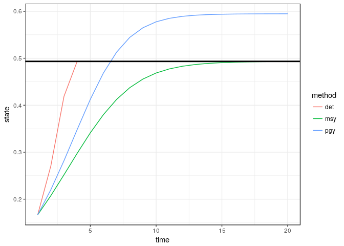

POMDP comparisons across sigma\_m, sigma\_g
================
Carl Boettiger
2017-10-11

``` r
# devtools::install_github("boettiger-lab/sarsop")  ## install package first if necessary.
library(sarsop)       # the main POMDP package
library(tidyverse)    # for munging and plotting
library(parallel)
```

``` r
options(mc.cores=9)
```

Basic deterministic model
-------------------------

``` r
r <- 0.75
K <- 1

## Classic Graham-Schaefer. Note that recruitment occurs *before* harvest
f <- function(x, h){ 
    x + x * r * (1 - x / K) - pmin(x,h)
}
```

Utility (reward) function:

``` r
reward_fn <- function(x,h) pmin(x,h)
discount <- 0.99
```

Calculating MSY
---------------

This uses a generic optimization routine to find the stock size at which the maximum growth rate is achieved.

``` r
## A generic routine to find stock size (x) which maximizes 
## growth rate (f(x,0) - x, where x_t+1 = f(x_t))
S_star <- optimize(function(x) -f(x,0) + x / discount, 
                   c(0, 2*K))$minimum
```

``` r
B_MSY <- S_star
MSY <- f(B_MSY,0) - B_MSY 

F_MSY <- MSY / B_MSY  
F_PGY = 0.8 * F_MSY
```

``` r
## Make sure these match the known analytic solutions for Graham-Schaefer model (only true of discount = 1)
if(discount == 1){
  testthat::expect_equal(B_MSY, K / 2)
  testthat::expect_equal(MSY, r * K / 4)
  testthat::expect_equal(F_MSY, r / 2)
}
```

As a basic reference point, simulate these three policies in a purely deterministic world. Unlike later simulations, here we consider all states an actions exactly (that is, within floating point precision). Later, states and actions are limited to a discrete set, so solutions can depend on resolution and extent of that discretization.

``` r
det_simulations(x0 = 1/6, Tmax = 20, B_MSY, F_MSY, F_PGY) %>%
  ggplot(aes(time, state, col=method)) + 
  geom_line() + 
  geom_hline(aes(yintercept=B_MSY), lwd=1) 
```



------------------------------------------------------------------------

Introduce a discrete grid
-------------------------

``` r
## Discretize space
states <- seq(0,2, length=100)
actions <- states
observations <- states
```

We compute the above policies on this grid for later comparison.

``` r
policies <- list(
  det = map_int(pmax(f(states,0) - S_star,0), ~ which.min(abs(actions - .x))),
  msy = map_int(states, ~ which.min(abs(actions - .x * F_MSY))),
  pgy = map_int(states, ~ which.min(abs(actions - .x * F_PGY))) )
```

POMDP Model
===========

We compute POMDP matrices for a range of `sigma_g` and `sigma_m` values:

``` r
meta <- expand.grid(sigma_g = c(0.02, 0.1, 0.2), 
                    sigma_m = c(0, 0.1, 0.2),
                    stringsAsFactors = FALSE) %>%
        mutate(scenario  = as.character(1:length(sigma_m)))
log_dir <- "appendix_alphas" # Store the computed solution files here
meta
```

      sigma_g sigma_m scenario
    1    0.02     0.0        1
    2    0.10     0.0        2
    3    0.20     0.0        3
    4    0.02     0.1        4
    5    0.10     0.1        5
    6    0.20     0.1        6
    7    0.02     0.2        7
    8    0.10     0.2        8
    9    0.20     0.2        9

``` r
models <- 
  parallel::mclapply(1:dim(meta)[1], 
           function(i){
  fisheries_matrices(
  states = states,
  actions = actions,
  observed_states = observations,
  reward_fn = reward_fn,
  f = f,
  sigma_g = meta[i,"sigma_g"][[1]],
  sigma_m = meta[i,"sigma_m"][[1]],
  noise = "normal")
})
```

POMDP solution
--------------

The POMDP solution is represented by a collection of alpha-vectors and values, returned in a `*.policyx` file. Each scenario (parameter combination of `sigma_g`, `sigma_m`, and so forth) results in a separate solution file.

Because this solution is computationally somewhat intensive, we provide

``` r
dir.create(log_dir)

## POMDP solution (slow, >10,000 seconds per scenario, & memory intensive)
system.time(
  alphas <- 
    parallel::mclapply(1:length(models), 
    function(i){
      log_data <- data.frame(model = "gs", 
                             r = r, 
                             K = K, 
                             sigma_g = meta[i,"sigma_g"][[1]], 
                             sigma_m = meta[i,"sigma_m"][[1]], 
                             noise = "normal",
                             scenario = meta[i, "scenario"][[1]])
      
      sarsop(models[[i]]$transition,
             models[[i]]$observation,
             models[[i]]$reward,
             discount = discount,
             precision = 0.00000002,
             timeout = 10000,
             log_dir = log_dir,
             log_data = log_data)
    })
)
```

We can read the stored solution from the log:

``` r
meta <- meta_from_log(data.frame(model="gs"), log_dir) %>% left_join(meta) %>% arrange(scenario)
alphas <- alphas_from_log(meta, log_dir)
```

Simulating the static policies under uncertainty
------------------------------------------------

``` r
Tmax <- 100
x0 <- which.min(abs(K/6 - states))
reps <- 100

static_sims <- 
 map_dfr(models, function(m){
            do_sim <- function(policy) sim_pomdp(
                        m$transition, m$observation, m$reward, discount, 
                        x0 = x0, Tmax = Tmax, policy = policy, reps = reps)$df
            map_dfr(policies, do_sim, .id = "method")
          }, .id = "scenario") 
```

Simulating the POMDP policies under uncertiainty
------------------------------------------------

``` r
# slower!
unif_prior <- rep(1, length(states)) / length(states)
pomdp_sims <- 
  map2_dfr(models, alphas, function(.x, .y){
             sim_pomdp(.x$transition, .x$observation, .x$reward, discount, 
                       unif_prior, x0 = x0, Tmax = Tmax, alpha = .y,
                       reps = reps)$df %>% 
              mutate(method = "pomdp") # include a column labeling method
           },
           .id = "scenario")
```

Combine the resulting data frames

``` r
sims <- bind_rows(static_sims, pomdp_sims) %>%
    left_join(meta) %>%    ## combine output with scenarios
    mutate(state = states[state], action = actions[action]) # index -> value

write_csv(sims, "sims.csv")
```

Figure S1
---------

We the results varying over different noise intensities, sigma\_g, and sigma\_m. Figure 1 of the main text considers the case of sigma\_g = 0.05, sigma\_m = 0.1

``` r
sims %>%
  select(time, state, rep, method, sigma_m, sigma_g) %>%
  group_by(time, method, sigma_m, sigma_g) %>%
  summarise(mean = mean(state), sd = sd(state)) %>%
  ggplot(aes(time, mean, col=method, fill=method)) + 
  geom_line() + 
  geom_ribbon(aes(ymax = mean + sd, ymin = mean-sd), col = NA, alpha = 0.2) +
  facet_grid(sigma_m ~ sigma_g)
```


Policy plots
------------

Historical data estimation
--------------------------

Historical data POMDP & other solutions
---------------------------------------

Historical combined plot
------------------------
