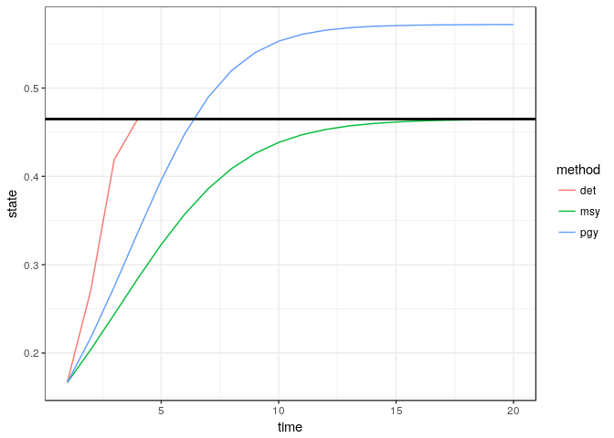
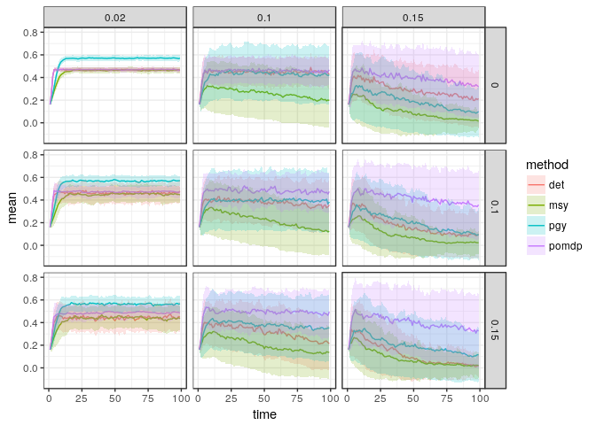
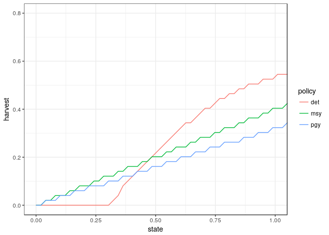
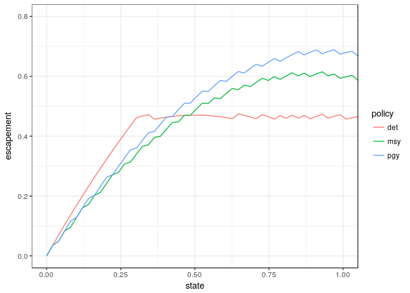
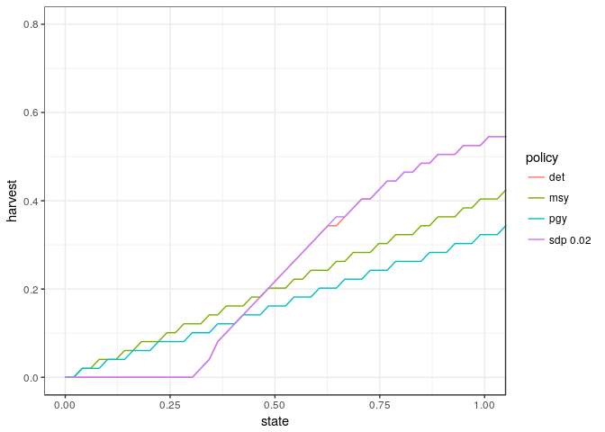
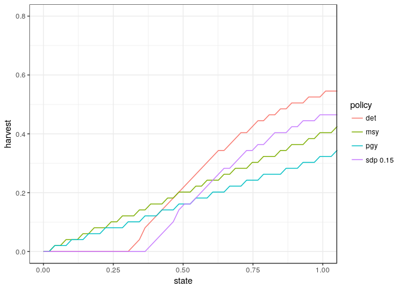
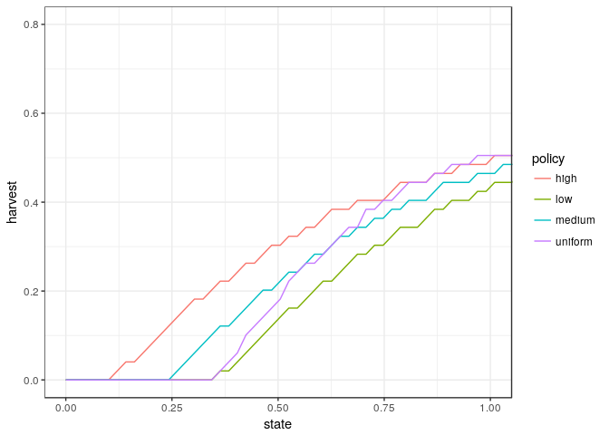
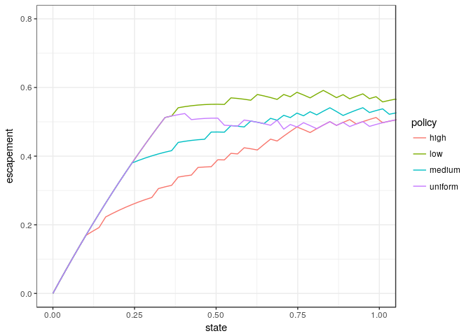

POMDP comparisons across sigma\_m, sigma\_g
================
2018-01-31

Basic deterministic model
-------------------------

Utility (reward) function:

Calculating MSY
---------------

This uses a generic optimization routine to find the stock size at which the maximum growth rate is achieved with respect to discount, i.e.
max*x*{*f*(*x*)−*x*/*δ*}

If we observe-&gt;recruit-&gt;harvest, *X**t* + 1 = *f*(*X**t*)−*h**t*, then we see the stock right after a harvest and before recuitment, when it is at $X\_t ~ *B**M**S**Y*.
If we instead did observe-&gt;harvest-&gt;recruit, we would see the stock at its pre-harvest size, $X\_t ~ B\_{MSY} + *H**M**S**Y*.

As a basic reference point, simulate these three policies in a purely deterministic world. Unlike later simulations, here we consider all states an actions exactly (that is, within floating point precision). Later, states and actions are limited to a discrete set, so solutions can depend on resolution and extent of that discretization.

------------------------------------------------------------------------

Introduce a discrete grid
-------------------------

We compute the above policies on this grid for later comparison.

POMDP Model
===========

We compute POMDP matrices for a range of `sigma_g` and `sigma_m` values:

    ##   sigma_g sigma_m scenario
    ## 1    0.02    0.00        1
    ## 2    0.10    0.00        2
    ## 3    0.15    0.00        3
    ## 4    0.02    0.10        4
    ## 5    0.10    0.10        5
    ## 6    0.15    0.10        6
    ## 7    0.02    0.15        7
    ## 8    0.10    0.15        8
    ## 9    0.15    0.15        9

POMDP solution
--------------

The POMDP solution is represented by a collection of alpha-vectors and values, returned in a `*.policyx` file. Each scenario (parameter combination of `sigma_g`, `sigma_m`, and so forth) results in a separate solution file.

Because this solution is computationally somewhat intensive, be sure to have ~ 4 GB RAM per core if running the 9 models in parallel. Alternately, readers can skip the evaluation of this code chunk and read the cached solution from the `policyx` file using the `*_from_log` functions that follow:

We can read the stored solution from the log:

Simulating the static policies under uncertainty
------------------------------------------------

Simulating the POMDP policies under uncertiainty
------------------------------------------------

Combine the resulting data frames

Figure S1
---------

We the results varying over different noise intensities, sigma\_g, and sigma\_m. Figure 1 of the main text considers the case of sigma\_g = 0.05, sigma\_m = 0.1

Policy plots
------------

Note that when recruitment occurs before harvest, *f*(*x*)−*h*, to get to *X**t* = *B**M**S**Y* as fast as possible, we actually want to harvest a little bit when X is below *B**M**S**Y*, so that rather than over-shooting *B**M**S**Y* (deterministic) recruitment would land us right at it *B**M**S**Y*. This corresponds to constant escapement. The discrete grid makes these appear slightly stepped.

Note that the deterministic solution crosses the MSY solution at an observed value of *B**M**S**Y* (i.e. *K*/2 = 0.5). PGY harvests are always smaller than MSY harvests, but unlike the deterministic optimal solution, PGY and MSY solutions never go to zero.

Note that when recruitment happens before harvest, escapement is *f*(*x**t*)−*h**t*, not *x**t* − *h**t*. The effect of a continuous function map *f* on a discrete grid is also visible as slight wiggles when we plot in terms of escapement instead of harvest (as is common in the optimal control literature in fisheries, e.g. @Sethi2005).

Note that under the optimal solution, escapement is effectively constant at *B**M**S**Y* = 0.5: for all states above a certain size the population is harvested back down to that size. Note that even stocks observed at states slightly below *B**M**S**Y* = 0.5 achieve this target escapement, since we are following the classic Graham Shaeffer formulation here where we observe first, then recruitment happens before harvest, and thus we see the population at smaller size than we harvest it. In classical escapement analysis, observations are usually indexed instead to occur immediately before harvests, and this inflection point occurs right at *B**M**S**Y*.

### Policies under uncertainty

In strategies whose policies are shown in the above plots all ignore both stochasticity and measurement error. If want to compare these to an MDP or POMDP policy, we must specify the level of uncertainty.

In the absence of measurement uncertainty this is straight forward. @Reed1979 essentially tells us that for small growth noise (satisfying or approximately satisfying Reed's self-sustaining condition) that the stochastic optimal policy is equal to the deterministic optimal policy. We can confirm this numerically as follows.

First we grab the transition matrix we have already defined for small `sigma_g`:

With no observation uncertainty, we can solve numerically for the optimal policy with stochastic dynamic programming

Adding this to the plot we see the result is identical to the deterministic case:

Repeating this for larger stochasticity, we get a slightly more conservative result:

### Comparing POMDP Policies

The comparison of POMDP policy is yet more complicated, but the POMDP policy cannot be expressed merely in terms of a target harvest (or escapement) level given an estimation of the stock size (state). The optimal solution for the partially observed system must also reflect all prior observations of the system, not merely the most recent observation, as the system is not Markovian in the observed state variable. We summarize this history as a prior "belief"" about the state, which is updated according to Bayes rule after each observation. (Note that @Sethi2005 fails to realize this and plots solutions with measurement uncertainty without reference to the prior, which explains their counter-intuitive finding that increased uncertainty should result in increased harvest rates).

Let us look at the POMDP solutions under various priors focusing on the case of moderate uncertainty, *σ**g* = *σ**m* = 0.1. (Recall we have already solved the POMDP solution for this model in the simulations above, as defined by the `alpha` vectors, so we can quickly load that solution now.)

We will consider what the POMDP solution looks like under a few different prior beliefs. A uniform prior sounds like a conservative assumption, but it is not: it puts significantly more weight on improbably large stock values than other priors. (Loading the *α* vectors from our POMDP solution computed earlier, we can then compute a POMDP given these *α*, the matrices for transition, observation, and reward, and the prior we are using)

For more realistic set of priors, we will consider priors centered at the target *B**M**S**Y* size (or *S*\* in the language of Reed), at half *B**M**S**Y*, and at 1.5 times *B**M**S**Y*, each with a standard deviation of *σ**m* = 0.1 (i.e. the uncertainty around a single observation of a stock at that size.)

We gather these solutions into a single data frame and convert from grid indices to continuous values

### Harvest

### Escapement

